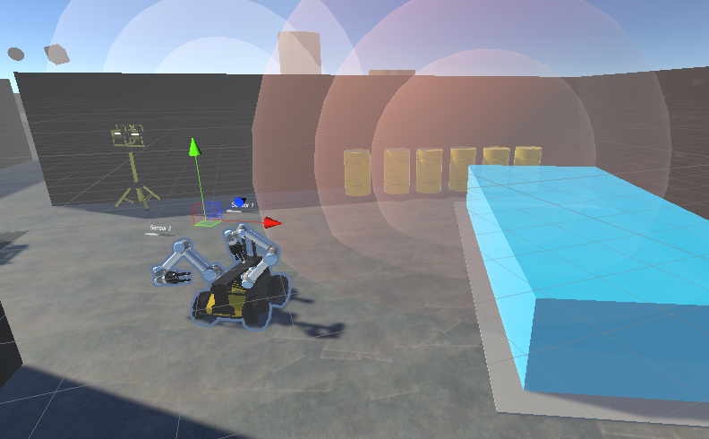

# Nuclear Facility Robot Simulator
A work-in-progress demonstration of a mobile robot in a nuclear facility undergoing decommissioning.

VR-Husky
Working prototype of a Clearpath Husky Robot Model with working wheel colliders in Unity world. Works with HTC Vive VR headsets.

Features:
1. Nuclear radiation spheres: 3 tiers of influence increase "damage" ticks to GameObject's health (using individualDetector.cs script)
2. Floater script: Attach to any object to simulate floating in liquid media (depends on floor height).
3. Teleporting (from SteamVR assets)

To Do:
1. Import URDF file using Unity Robotics Hub URDF Importer
2. Send messages back to ROS using Rosbridge/ROS-sharp or Unity Robotics Hub

© 2022 Paul Baniqued, The University of Manchester, UK
